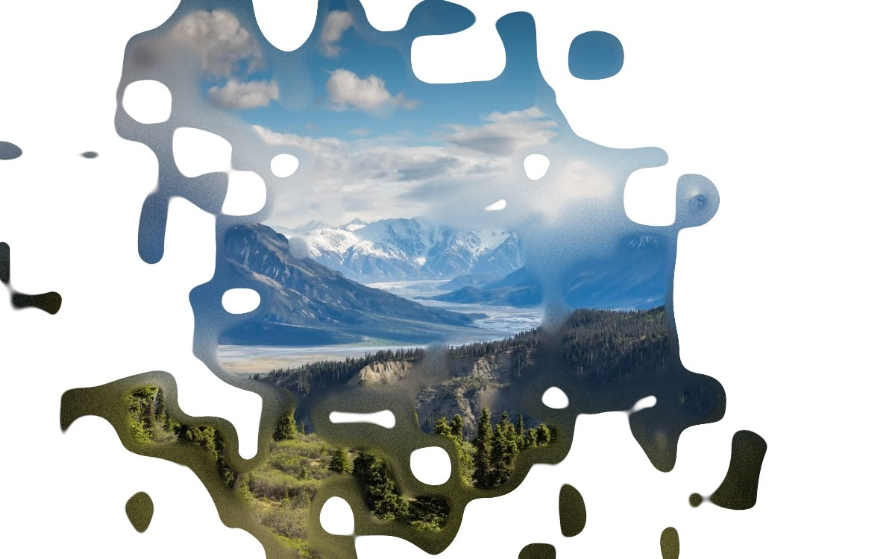

# Liquid lens



A photograph, and a body of liquid you move over it with the pointer. Seven
soft bodies chase your hand; where two are near each other their fields add,
so the outline around them is one closed curve with a waist rather than two
circles overlapping. That merging is the whole of why it reads as liquid and
not as a string of discs. Inside the shape the picture is drawn, out of focus
at the edge and sharp deep in; outside it there is nothing.

**[See it running](https://angelolibero.github.io/liquid-lens/)** — every
number it has is a slider, because an effect shown at one tuning is a
screenshot that happens to move.

## Using it

```tsx
import { LiquidLens } from "./liquid-lens/LiquidLens";

<LiquidLens
  src="https://images.unsplash.com/photo-1464822759023-fed622ff2c3b?w=1600"
  className="absolute inset-0"
/>;

// or, with its own tuning and nothing moving by itself
<LiquidLens
  src={url}
  values={{ corner: 7.4, warp: 0.06, fade: 0.02 }}
  animate={false}
  className="absolute inset-0"
/>;
```

That is the whole API. `values` takes any of the knobs below and falls back to
the defaults for the rest; `paper` is the colour `Room light` mixes toward.

Copy `src/liquid-lens/` into your project: five files with no dependency
beyond React. The component, the shader, the table of knobs, the presets, and
the list of demo photographs you will probably replace.

## The knobs

| Knob | What it does |
| --- | --- |
| Body size | How big each body is, as a fraction of the light's radius. |
| Body corners | 1 is a diamond, 2 the circle, 8 all but a square. |
| Body spacing | How far apart the bodies sit when the pointer is still. At 0 they land on one point and there is nothing to merge. |
| Trailing bodies | How much smaller each body in the trail is than the one before it. |
| Merge level | Where the level line sits in the field: low and everything fuses into one lake, high and the drops separate sooner. |
| Fades to page | The width of the shore. At the floor there is none and the edge is a cut. |
| Blurred depth | How deep into the body the picture takes to come back into focus. |
| Blur strength | How far out of focus the picture is at the shallow end, in pixels. |
| Coast wander | How far noise pushes the boundary around. This is what makes the edge a coastline instead of an arc. |
| Coast grain | How fine that wander is. |
| Room light | How much of the page's own paper is laid over the photograph. |

And seven for what it does when nobody is pointing at it, behind a switch that
turns the lot off at once:

| Knob | What it does |
| --- | --- |
| Size wander | How much the radius breathes as it travels. |
| Overall speed | The rate of everything that moves on its own. The three rates below are relative to it, so this is the knob for *it is too fast*. |
| Drift reach | How far it wanders on its own, as a fraction of the box. At 0 it parks in the middle and waits. |
| Drift speed | How fast it travels that path. Two frequencies that do not divide each other, so it never quite repeats. |
| Chase | How quickly the bodies catch what they follow. Low is a long lagging trail, high is a shape glued to the pointer. |
| Churn | How fast each body walks its own small circle: the movement inside the shape when it is otherwise still. |
| Coast flow | How fast the coastline noise drifts. Keep it well under the speed of a hand. |

**`animate: false` stops one clock.** Everything that happens without a hand
on the page is a function of it, so the drift, the churn, the coastline and the
breathing radius all stop together, in place. The chase is not on that clock
and keeps working: off, this is a shape that does what your hand does and
nothing else.

## Eight presets

`Liquid lens`, `Mercury`, `Tiles`, `Mist`, `Ink`, `Frosted`, `Comet`, `Lake`.
Each turns one or two decisions hard over and lets the rest follow, rather
than nudging nine numbers nobody could name. They are in
`src/liquid-lens/presets.ts` with a line each saying what the move was.

**Two of these fight each other.** The corners live in the level line and the
warp displaces where that line is read, so above about 0.15 of `Coast wander`
the flattened sides are gone. Turn the wander down if you want to see the
squareness; turn it up if you want the coastline. You cannot have both, and
knowing that is more useful than either.

## Three things worth knowing if you read the code

**The bodies are gaussians, not inverse squares.** `1/d²` has no end: every
body is felt everywhere, so the threshold has to be tuned against the whole
population and a body on the far side of the screen still nudges the boundary
here. A gaussian is numerically zero within a few sigma, which makes each body
local, the field cheap, and the shape stable while one drifts away.

**The corners are built without a single `pow`.** The straight spelling of a
superellipse is `pow(pow(x, n) + pow(y, n), 2/n)`, three transcendentals per
body per pixel, twenty-one over every pixel of a full-screen canvas every
frame. It measures fine on a desktop and is a great deal to ask of a phone.
Four exponents are exact and cheap instead, and the knob rides between them:
1 is `(|x| + |y|)²`, 2 is the dot product, 4 is `sqrt(dot(n², n²))`, 8 is the
same trick once more.

**The fade and the blur are two surfaces, not one.** One number driving both
makes them one thing: as soon as the edge is crisp enough to read as liquid
there is no depth of picture left out of focus, and softening it enough to look
through dissolves the shape. Separated, a hard edge over a long soft interior
is a thick body seen through, and a wide fade over a sharp picture is a mist.

## On touch devices it drifts

The effect follows a pointer, and a finger is not a hovering hand: a light that
jumped to wherever you last tapped would be a light being poked. Touch events
are ignored, so on a phone the shape wanders along its own slow path. If you
ship this, consider giving touch devices a still image instead: every pixel
inside the shape runs a twelve-tap blur of the photograph, which is a lot to
ask of the machine with the least memory bandwidth for an effect nobody there
can steer.

## Photographs

None are committed. The demo hotlinks Unsplash's CDN, which sends
`access-control-allow-origin: *` — the header a WebGL texture needs to be
readable at all. Paste any image URL from a host that does the same. If it
draws nothing, that header is why.

Photographs in the demo by Kalen Emsley, Sergey Pesterev, Casey Horner,
Pedro Lastra and Ayo Ogunseinde, on Unsplash. The image at the top of this
file is the shader's own output over Kalen Emsley's photograph, not a mockup:
it was rendered by the same fragment shader this repository ships.

## Running it

```bash
npm install
npm run dev
```

React, Vite, Tailwind and a few shadcn/ui components for the panel, on the
Radix primitives. The effect itself is plain WebGL and knows about none of
them: `src/liquid-lens/` is five files you can copy into anything.

MIT.
